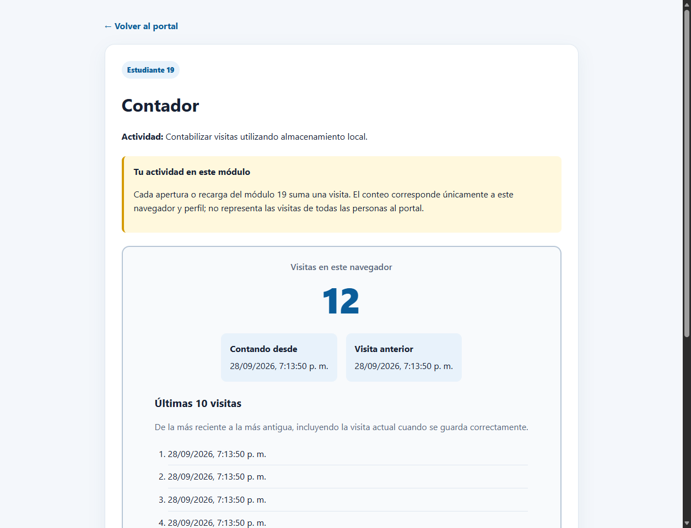
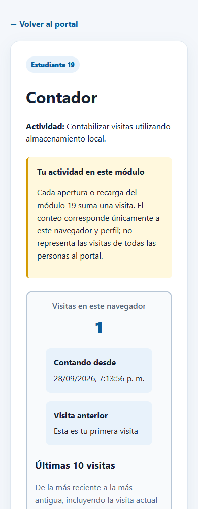

# Evidencia local — Módulo 19

- Fecha: 28 de septiembre de 2026 (America/Guatemala).
- Resultado final: **12 pruebas aprobadas, 0 fallos y 0 errores**.
- Duración de la suite final: 11.508 segundos.
- Entorno: Windows, Python 3.12, Selenium 4.49.0 y Microsoft Edge 154.0.4258.37 en modo headless.
- Servidor HTTP en 127.0.0.1 y puerto libre; perfil temporal independiente del navegador del usuario.
- Vista móvil emulada: 390 × 1000 píxeles CSS.
- Verificaciones adicionales: sintaxis JavaScript con `node --check`, `git diff --check` y respuesta HTTP 200 del módulo servido localmente.

La ejecución registrada usa la opción Edge de la suite. La ejecución con Chrome queda
sin verificar en esta PC: el Chromium disponible no inició con WebDriver.
El controlador antiguo de Edge se sustituyó automáticamente por uno compatible mediante
Selenium Manager. En la prueba de navegación se desplazó la tarjeta al centro de forma
inmediata antes del clic para evitar la animación de desplazamiento del portal.

Ver [salida completa de la ejecución final](ejecucion.txt) y
[casos, pasos y resultados esperados](../README_19_contador.md).
Los 12 casos documentados obtuvieron el resultado esperado en esta ejecución.

## Capturas revisadas

### Escritorio: total 12 e historial limitado a 10

### Móvil: primera visita y fechas, sin desbordamiento horizontal

Las capturas muestran el área visible de la página; el resto del historial se consulta
desplazándose verticalmente. Las pruebas verifican los diez elementos completos.

## Pendientes externos

Esta evidencia es local. No se ha realizado push, creado un PR, ejecutado el pipeline
del equipo ni obtenido revisión de un compañero. Esos pasos se completarán con la rama
oficial y la configuración de CI del proyecto.
